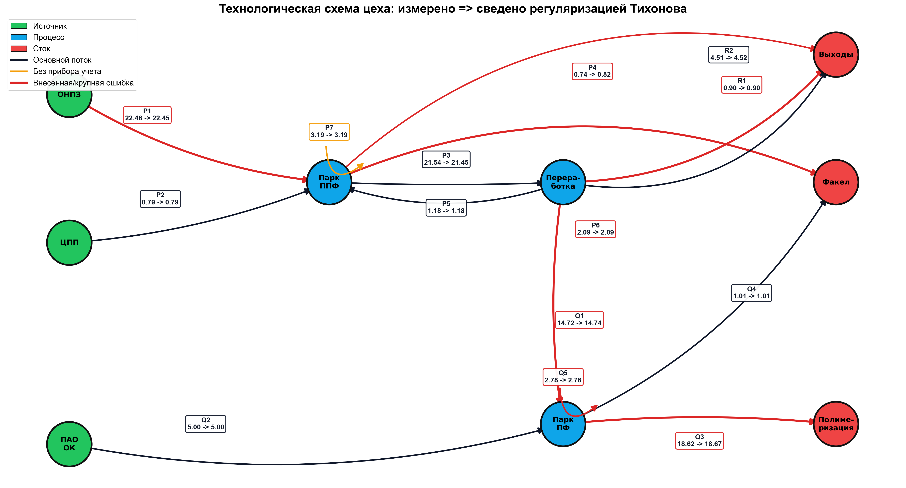
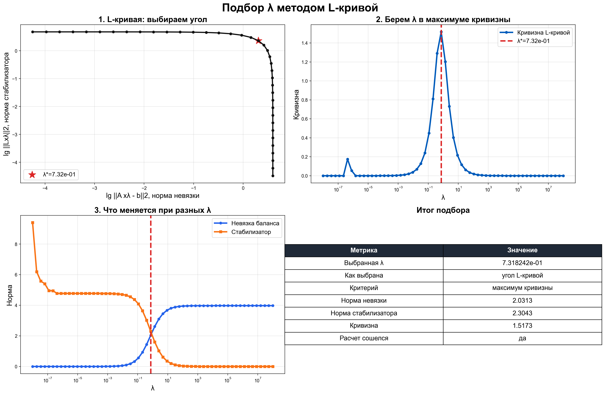
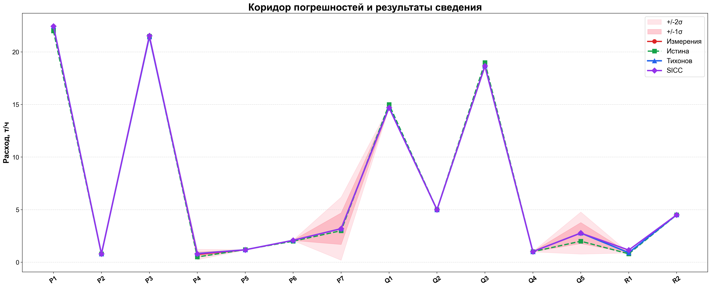
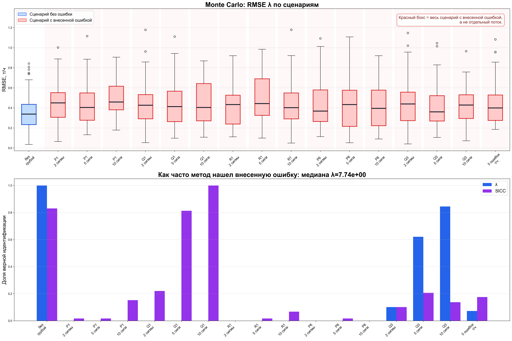

# Process Flow Data Reconciliation

Учебно-исследовательский Python-проект для сведения материального баланса технологической схемы цеха.

Проект моделирует измерения расходов по потокам, добавляет шум и грубые ошибки, затем восстанавливает согласованные значения потоков методом регуляризации Тихонова. Параметр регуляризации выбирается по методу L-кривой. Для сравнения реализован метод SICC, а устойчивость решений проверяется методом Монте-Карло.

## Возможности

- расчет материального баланса для схемы цеха;
- моделирование измерительного шума датчиков;
- внесение грубых ошибок в заданные потоки;
- сведение баланса регуляризацией Тихонова;
- автоматический подбор параметра регуляризации по L-кривой;
- поиск точки сгиба L-кривой через численное приближение кривизны;
- сравнение с методом SICC;
- Monte Carlo-анализ на 1000 случайных прогонов;
- генерация читаемых графиков и CSV-таблиц.

## Используемые методы

- **Регуляризация Тихонова** для восстановления согласованных потоков.
- **Взвешенные наименьшие квадраты** для учета разных погрешностей датчиков.
- **SLSQP** как численный метод решения задачи оптимизации.
- **Метод L-кривой** для выбора параметра регуляризации.
- **Численная кривизна L-кривой** для поиска точки сгиба.
- **Метод Монте-Карло** для проверки устойчивости алгоритмов.
- **SICC** как дополнительный метод сравнения.

QR, SVD и разложение Холецкого напрямую в коде не используются. Основная задача решается через `scipy.optimize.minimize(..., method="SLSQP")`.

## Постановка задачи

Для каждого значения параметра регуляризации решается задача:

```text
минимизировать:
ошибка баланса + lambda * поправка измерений
```

Смысл:

- первый член заставляет материальный баланс сходиться;
- второй член не дает слишком сильно менять исходные измерения;
- `lambda` задает компромисс между этими двумя требованиями.

Правая часть баланса для внутренних узлов равна нулю: вход в узел минус выход из узла должен быть равен нулю.

## Схема цеха

В текущей модели используется 14 потоков:

```text
P1-P7 = 7 потоков
Q1-Q5 = 5 потоков
R1-R2 = 2 потока

Итого: 14 потоков
```

В основном сценарии грубые ошибки добавляются в 5 потоков:

| Поток | Название | Истина, т/ч | Погрешность, т/ч | Внесенная ошибка, т/ч |
|---|---|---:|---:|---:|
| P1 | ППФ с ОНПЗ | 22.0 | 0.0550 | +0.4400 |
| P6 | Сдувки у/в на факел (ППФ) | 2.0 | 0.0150 | +0.1050 |
| Q1 | Пропилен с переработки | 15.0 | 0.0336 | -0.2688 |
| Q3 | Пропилен на полимеризацию | 19.0 | 0.0426 | -0.3405 |
| R1 | Топливный газ (отдувки) | 0.8 | 0.0100 | +0.1000 |

Обычный шум датчиков моделируется нормальным распределением с нулевым средним и стандартным отклонением, равным погрешности датчика.

## Структура проекта

```text
.
├── main_plant.py                  # основной запуск расчета и построение графиков
├── tikhonov_solver.py             # регуляризация Тихонова и подбор lambda
├── sicc_lib.py                    # реализация SICC для сравнения
├── test_tikhonov_solver.py        # тесты
├── requirements.txt               # зависимости
├── lambda_explanation_A4.md       # простое объяснение подбора lambda
└── plant_results_lcurve_lambda/   # готовые графики и CSV-результаты
```

## Установка

```powershell
pip install -r requirements.txt
```

## Запуск

Основной расчет:

```powershell
python main_plant.py
```

Быстрый запуск Monte Carlo на меньшем числе прогонов:

```powershell
$env:PLANT_MC_TRIALS="100"
python main_plant.py
Remove-Item Env:\PLANT_MC_TRIALS
```

Проверка тестов:

```powershell
pytest -q
```

Ожидаемый результат:

```text
6 passed
```

## Примеры результатов

### Технологическая схема потоков



### Подбор параметра регуляризации (L-кривая)



### Коридоры погрешностей и результаты сведения



### Monte Carlo — итоговая сводка



---

## Результаты

После запуска результаты сохраняются в папку:

```text
plant_results_lcurve_lambda/
```

Основные файлы:

| Файл | Содержание |
|---|---|
| `plant_graph_readable.png` | технологическая схема потоков |
| `plant_lambda_optimization.png` | подбор lambda методом L-кривой |
| `plant_corridor_readable.png` | коридоры погрешностей и результаты сведения |
| `plant_delta.png` | поправки потоков |
| `plant_relative_error.png` | относительная ошибка по потокам |
| `plant_error_histograms.png` | распределение ошибок по Monte Carlo |
| `plant_monte_carlo_summary.png` | итог Monte Carlo по сценариям |
| `plant_analytics_readable.png` | итоговая таблица по потокам |
| `plant_stream_names.png` | расшифровка ID потоков |
| `plant_single_run.csv` | один основной расчет |
| `plant_monte_carlo.csv` | все Monte Carlo-прогоны |
| `plant_scenario_summary.csv` | средние значения по сценариям |

## Подбор lambda

Для разных значений `lambda` программа заново решает задачу сведения баланса. После этого строится L-кривая:

```text
ось X: логарифм нормы невязки баланса
ось Y: логарифм нормы стабилизатора
```

Точка выбора `lambda` определяется как точка максимальной кривизны L-кривой.

В коде это реализовано в `tikhonov_solver.py`:

- `_lcurve_norms()` строит координаты L-кривой;
- `_lcurve_curvature()` считает численную кривизну;
- `_lcurve_corner_index()` выбирает точку максимальной кривизны;
- `optimize_lambda_nested()` выполняет подбор `lambda`.

Для численного приближения производных используется `numpy.gradient`. Для внутренних точек это соответствует центральной разностной схеме.

## Monte Carlo

По умолчанию выполняется 1000 прогонов.

В Monte Carlo проверяются:

- сценарий без грубой ошибки;
- одиночные ошибки в отдельных потоках;
- разные уровни ошибки: 2, 5 и 10 погрешностей датчика;
- комбинированный сценарий с 5 внесенными ошибками.

Верхняя часть `plant_monte_carlo_summary.png` показывает распределение RMSE по сценариям. Нижняя часть показывает долю верной идентификации внесенной ошибки.

## Ограничения

Проект является учебно-исследовательской моделью. Он не является готовой промышленной системой.

Ограничения:

- используется только материальный баланс;
- энергетический баланс не реализован;
- значения потоков и погрешностей заданы в коде как тестовая модель;
- истинные значения известны только для проверки качества алгоритмов;
- для реального объекта потребуются реальные измерения, схема, метрология датчиков и проверка технологических ограничений.

## Назначение

Проект подходит как демонстрация численных методов для задачи data reconciliation:

- для дипломной работы;
- для учебного исследования;
- для портфолио по численным методам и анализу технологических данных.

